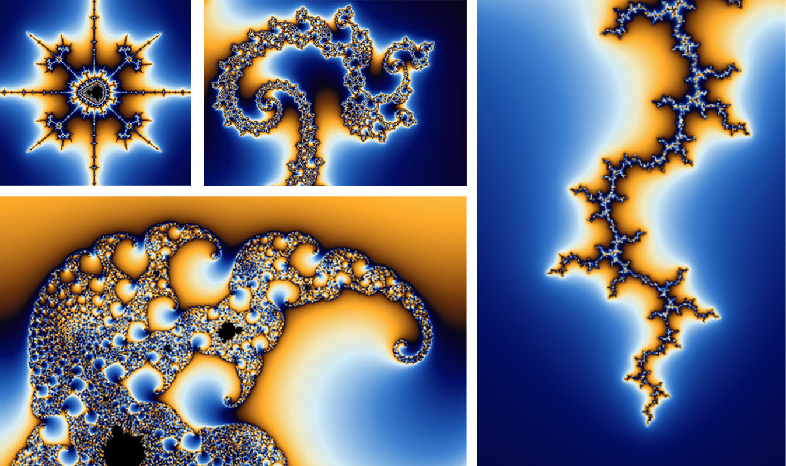

# Interactive and animated Mandelbrot implementation 

A Mandelbrot is a mathematical set of complex numbers c for which the sequence z = z² + c does not tend to infinity. The visual diversity arises by coloring its complement. When zooming into the edges of the Mandelbrot set, obscure yet highly fascinating patterns and structures can be discovered. In math, there is no maximum zoom depth, but in my program, it is limited by the 32-bit float precision of WebGL.

